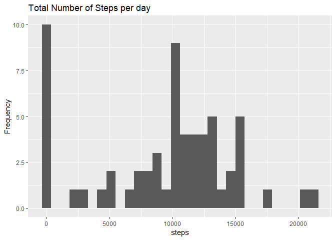
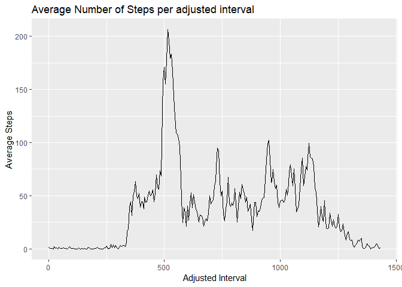
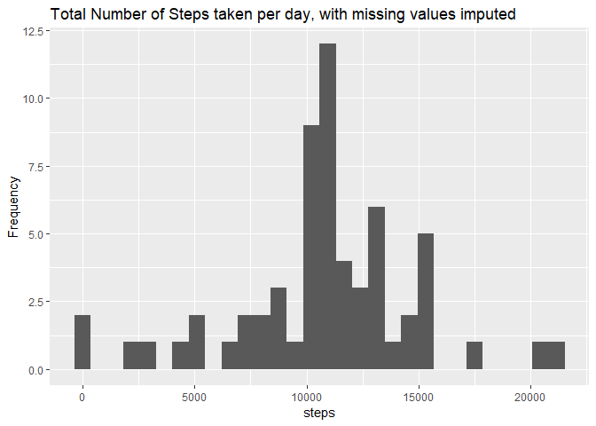
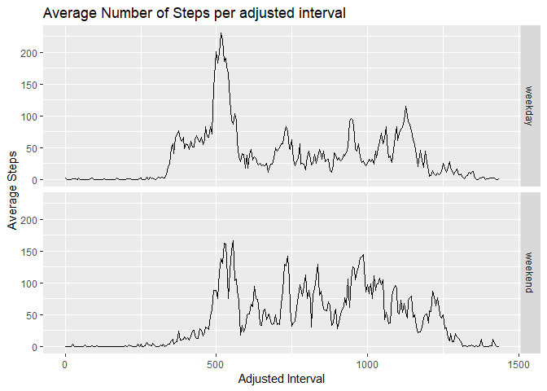

## Loading and preprocessing the data

```r
require(lubridate)
```

```
## Loading required package: lubridate
```

```
## 
## Attaching package: 'lubridate'
```

```
## The following object is masked from 'package:base':
## 
##     date
```

```r
require(dplyr)
```

```
## Loading required package: dplyr
```

```
## 
## Attaching package: 'dplyr'
```

```
## The following objects are masked from 'package:lubridate':
## 
##     intersect, setdiff, union
```

```
## The following objects are masked from 'package:stats':
## 
##     filter, lag
```

```
## The following objects are masked from 'package:base':
## 
##     intersect, setdiff, setequal, union
```

```r
require(ggplot2)
```

```
## Loading required package: ggplot2
```

```r
if(!file.exists("activity.csv")){
        download.file("https://d396qusza40orc.cloudfront.net/repdata%2Fdata%2Factivity.zip",
                      "activity.zip")
        unzip("activity.zip")
}
a <- read.csv("activity.csv")
a$date <- ymd(a$date)
```

## What is mean total number of steps taken per day?

```r
date_a <- group_by(a, date)
c <- summarise(date_a, steps = sum(steps, na.rm = TRUE))
print(qplot(steps, data = c, ylab = "Frequency", main = "Total Number of Steps per day", bins = 30))
```

<!-- -->

```r
mean_ts <- mean(c$steps)
median_ts <- median(c$steps)
```
The mean total number of steps per day is 9354.2295082. The median total number of steps per day is 10395.


## What is the average daily activity pattern?
For this plot, the interval index was adjusted to be linear, as using the original index would distort the plot for the intervals between 55 - 00 each hour, stretching them to take up more than 40% of the length of the plot in the x-direction, rather than the correct ~8%.

```r
int_a <- group_by(a, interval)
d <- summarise(int_a, steps = mean(steps, na.rm = TRUE))
print(qplot((interval %% 100 + ((interval %/% 100)*60)), steps, data = d, geom = "line", xlab = "Adjusted Interval", ylab = "Average Steps", main = "Average Number of Steps per adjusted interval"))
```

<!-- -->

```r
msteps <- d[d$steps == max(d$steps),]$interval
adj_msteps <- msteps %% 100 + ((msteps %/% 100)*60)
```
The interval with the highest average number of steps is 835, which is adjusted to 515 on the plot.

## Imputing missing values
Here we impute missing steps values by assigning the mean value of steps for that interval across the days for which that interval has a steps value.

```r
imp_a <- a 
for(i in 1:17568){
        if(is.na(imp_a$steps[i])){
                if((i %% 288) != 0){
                        imp_a$steps[i] <- d[i %% 288,]$steps
                }
                else imp_a$steps[i] <- d[288,2]
        }
}
imp_a$steps <- as.numeric(imp_a$steps)
date_ia <- group_by(imp_a, date)
date_ia <- summarise(date_ia, steps = sum(steps))
print(qplot(steps, data = date_ia, ylab = "Frequency", main = "Total Number of Steps taken per day, with missing values imputed", bins = 30))
```

<!-- -->

```r
mean_impts <- format(mean(date_ia$steps), scientific = FALSE)
median_impts <- format(median(date_ia$steps), scientific = FALSE)
```
After imputing the missing values using the means for an interval, the mean total number of steps per day is 10766.19. The median total number of steps per day is 10766.19. Replacing missing values with imputed values will increase the total number of steps on a day, which is shown by the increased mean and median values, and is also clear on the histogram.

## Are there differences in activity patterns between weekdays and weekends?
For this plot, the interval index was adjusted to be linear, as using the original index would distort the plot for the intervals between 55 - 00 each hour, stretching them to take up more than 40% of the length of the plot in the x-direction, rather than the correct ~8%. Here the dataset with missing values imputed as described above is used.

```r
dayname <- weekdays(imp_a$date)
wk <- c("Monday","Tuesday","Wednesday","Thursday","Friday")
t <- dayname %in% wk
imp_a <- mutate(imp_a, daytype = factor(as.character(t),levels = c("TRUE","FALSE"), labels = c("weekday","weekend")))
dayint_ia <- group_by(imp_a, daytype, interval)
e <- summarise(dayint_ia, steps = mean(steps))
e$interval <- (e$interval %% 100 + ((e$interval %/% 100)*60))
print(qplot(interval,steps,data = e, facets = daytype~., geom = "line", main = "Average Number of Steps per adjusted interval", xlab = "Adjusted Interval", ylab = "Average Steps"))
```

<!-- -->
